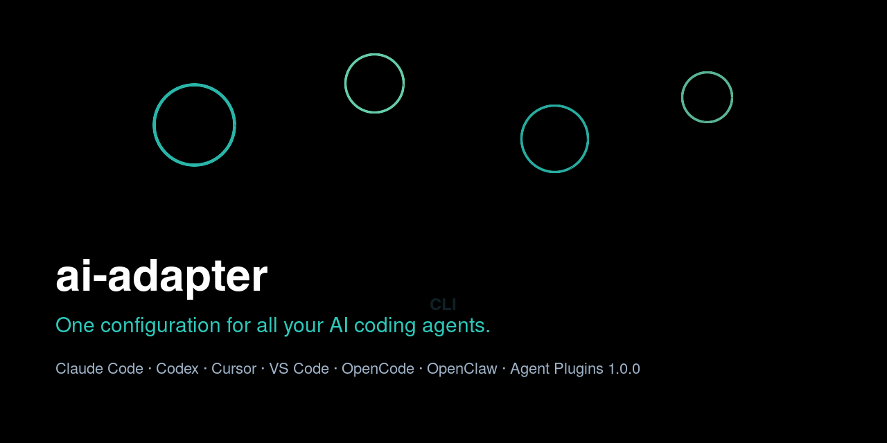

# ai-adapter

**One configuration for all your AI coding agents.**

[](https://github.com/smapira/ai-adapter-01/actions/workflows/ci.yml) [](https://agent-plugins.org/) [](https://www.python.org/)

Manage and sync your AI agent configuration across Claude Code, Codex, Cursor, VS Code, OpenCode and more.

```bash
# Get started in 3 commands
pip install ai-adapter
ai-adapter init
ai-adapter start <your-config-repo-url>
```

```text
            ┌─────────────┐
            │  ai-adapter  │
            └──────┬──────┘
       ┌───────────┼───────────┐
       ▼           ▼           ▼
 ┌─────────┐ ┌─────────┐ ┌─────────┐
 │ Claude  │ │  Codex  │ │  Cursor │
 │  Code   │ │   CLI   │ │  rules  │
 └─────────┘ └─────────┘ └─────────┘
     ▼           ▼           ▼
 ┌─────────┐ ┌─────────┐ ┌─────────┐
 │ VS Code │ │ OpenCode│ │ OpenClaw│
 └─────────┘ └─────────┘ └─────────┘
```



> ## ⭐ Agent Plugins 1.0.0 Compliant
>
> `ai-adapter` natively supports the **Agent Plugins 1.0.0** open standard
> ([agent-plugins.org](https://agent-plugins.org/)) — the vendor-neutral packaging
> format for skills + MCP servers backed by AWS, Microsoft, OpenAI, Anysphere, and Vercel.
> Build, validate, and distribute portable plugin packages with:
>
> ```bash
> ai-adapter plugin build my-plugin
> ai-adapter plugin validate ./my-plugin
> ```
>
> Your skills and MCP servers become portable across Copilot, Cursor, Codex,
> VS Code, AWS Kiro and more — with a single `plugin.json` manifest.

A CLI tool for managing AI agent instruction files (`.github/instructions` etc.) and scripts in groups. Easily share and migrate settings across environments.

---

## Features

- **Agent Plugins 1.0.0 Compliant**: Native support for the industry-standard plugin format — `plugin build` scaffolds a portable package, `plugin validate` checks `plugin.json` / `mcp.json` / `skills/` against the spec (name rules, server types, `${PLUGIN_ROOT}` placeholders, reserved env keys, SKILL.md frontmatter)
- **Centralized Management**: All data is consolidated under `~/.ai-adapter/`. Centrally manage settings across projects
- **Environment Switching**: Switch agent settings and scripts per environment (e.g., work, home)
- **GitHub Sync**: Use `ai-adapter sync` to sync `~/.ai-adapter/` with a GitHub remote. Easy team sharing and PC migration
- **Agent Binding**: Bind agent names to environments for automatic resolution based on context
- **Skill Management**: Manage and deploy skills in SKILL.md format (`.github/skills/`)
- **Command Management**: Manage and deploy VS Code custom command definitions (`.github/commands/`)
- **Prompt Management**: Manage and deploy prompt templates for AI agents (`.github/prompts/`)
- **MCP Server Management**: Centrally manage MCP server settings and output in each tool format
- **OpenCode Integration**: Generate `opencode.json` with MCP, skills, prompts, and agents; symlink `.opencode` → `.github`
- **OpenClaw Integration**: Export MCP servers and skills to OpenClaw format (`--format openclaw`)
- **Cursor Integration**: Export MCP servers and skills to Cursor format (`--format cursor` → `.cursor/mcp.json` + `.cursor/rules/*.mdc`)
- **Codex CLI Integration**: Generate `AGENTS.md` for OpenAI Codex CLI (`ai-adapter codex install`)
- **Root-Level Agent Management**: Manage `AGENTS.md`, `CLAUDE.md`, etc. as first-class artifacts, deployable to project root

---

## Supported Tools

| Tool | Status | Integration |
|------|--------|-------------|
| **GitHub Copilot** | ✅ Partial | `.github/` (agents, skills, commands, prompts, bins) + `.mcp.json` |
| **Claude Code** | ✅ Via `.github/` | Root-level files (`AGENTS.md`, `CLAUDE.md`) + `.github/` fallback |
| **OpenCode** | ✅ Full | `ai-adapter opencode install` → `opencode.json` (+ `.opencode` symlink) |
| **Codex CLI** | ✅ Full | `ai-adapter codex install` → `AGENTS.md` |
| **Cursor** | ✅ Skills + MCP | `--format cursor` → `.cursor/rules/*.mdc` + `.cursor/mcp.json` |
| **OpenClaw** | ✅ Partial | `--format openclaw` → `~/.openclaw/` (MCP + skills) |
| **Orca** | ✅ Partial | Shared `~/.claude/skills/` + `.mcp.json` via OpenClaw-style export |
| **Agent Plugins 1.0.0** | ✅ Full | `ai-adapter plugin build/validate` (portable packages) |

Not supported yet:

| Tool | Status | Notes |
|------|--------|-------|
| **Continue** | ❌ Planned | `.continuerc.json` rules export is a future task |

Per-file-type details: [LLM Tool Specification Comparison](documents/wiki/LLM-Tool-Comparison.md).

---

## Installation

### Prerequisites

- Python 3.10+
- [uv](https://docs.astral.sh/uv/) (package management)

```bash
# Also installable via pip
pip install ai-adapter

# Or use uv
uv pip install ai-adapter
```

### Upgrade

```bash
# Upgrade via pip
pip install --upgrade ai-adapter

# Upgrade via uv
uv pip install --upgrade ai-adapter

# Upgrade to the latest development version
cd ai-adapter && git pull && uv sync && uv pip install -e .
```

### Development Version

```bash
git clone <repository-url>
cd ai-adapter
uv sync
uv pip install -e .
```

### Verification

```bash
ai-adapter --help
ai-adapter --version
```

---

## Quick Start

```bash
# 1. Initialize
ai-adapter start https://github.com/YOUR-REPO/YOUR-CONFIG.git

# 2. Add an agent file (for .github/agents/, e.g. individual .agent.md files)
ai-adapter sub-agent add ~/my-agents/reviewer.md

# 2b. Add a root-level agent file (for project-root AGENTS.md/CLAUDE.md)
ai-adapter agent add ~/my-agents/AGENTS.md

# 3. Add an environment
ai-adapter env add myhome

# 4. Add a script
ai-adapter bin add --env myhome ~/scripts/deploy.sh

# 5. Add a skill (optionally with --env)
ai-adapter skill add ~/my-skills/database-schema
ai-adapter skill add --env myhome ~/my-skills/database-schema

# 6. Add an MCP server
ai-adapter mcp add github --command npx --args @modelcontextprotocol/server-github

# 7. Deploy to a project
cd your-project
ai-adapter sub-agent get reviewer      # → .github/agents/reviewer.md
ai-adapter agent get AGENTS            # → ./AGENTS.md (project root)
ai-adapter bin get --env myhome deploy   # → .github/bin/deploy.sh
ai-adapter skill get database-schema  # → .github/skills/database-schema/
ai-adapter skill get-all --env myhome # → deploy only myhome skills
ai-adapter mcp get                     # → .mcp.json

# 8. Deploy to OpenClaw (optional, requires OpenClaw installed)
ai-adapter mcp get --format openclaw          # → ~/.openclaw/openclaw.json
ai-adapter skill get-all --format openclaw    # → ~/.openclaw/skills/

# 9. Sync with GitHub (share settings)
ai-adapter sync
```

---

## Command Reference

### `ai-adapter start <URL>`

One-click setup of `~/.ai-adapter/` by linking with a GitHub remote repository.
Attempts to clone, and if that fails, initializes as a new repository.

```bash
# Setup from a new or existing repository
ai-adapter start git@github.com:user/my-agent-config.git
```

### `ai-adapter init`

Initializes the `~/.ai-adapter/` directory and configuration file (creates `agents/`, `bin/`, `skills/`, `commands/`, `prompts/`, `instructions/`, `mcp/` directories).
You can set a remote repository via the `--remote` option or an interactive prompt.

```bash
# Minimal initialization (remote can be set later)
ai-adapter init

# Initialize with a remote specified
ai-adapter init --remote git@github.com:user/my-agent-config.git
```

### `ai-adapter status`

Displays the current status (registration counts, default environment, etc.).

```bash
ai-adapter status
```

### `ai-adapter add-all-rec`

Batch-registers all files under `.github/` and `.mcp.json` into `~/.ai-adapter/`.
Also discovers root-level files (AGENTS.md, AGENT.md, CLAUDE.md, copilot-instructions.md)
and registers them into `~/.ai-adapter/instructions/`.
Run this after cloning a synced repository to automatically restore configuration from files.

```bash
# Run from the project root
ai-adapter add-all-rec
```

### `ai-adapter get-all-rec`

Deploys **all** registered items across all categories to `.github/` at once.
The reverse of `add-all-rec` — runs `sub-agent get-all` + `bin get-all` + `skill get-all` +
`command get-all` + `prompt get-all` + `agent get-all` (root instructions) + `mcp get` in a single command.

| Option | Description |
|--------|-------------|
| `--force` | Overwrite existing files without prompting |
| `--env` | Filter by environment name (only deploy items for this env) |
| `--project-dir`, `-d` | Target project directory (default: current directory) |
| `--no-summary` | Skip the diagnostic summary shown before deployment |

```bash
# Deploy everything from ~/.ai-adapter/ to the current project
ai-adapter get-all-rec

# Deploy only items for a specific environment
ai-adapter get-all-rec --env remote

# Force overwrite to a specific project
ai-adapter get-all-rec --force --project-dir /path/to/project

# Skip the pre-deploy diagnostic summary
ai-adapter get-all-rec --no-summary
```

### `ai-adapter agent`

Manages root-level agent instruction files (`AGENTS.md`, `CLAUDE.md`, `copilot-instructions.md`).
Deploys to **project root** (`./`).

| Command | Description |
|---------|------|
| `agent add <path>` | Add a root-level file to `~/.ai-adapter/instructions/` |
| `agent add-rec <dir>` | Recursively register all files in a directory |
| `agent get <name>` | Copy to project root (`./AGENTS.md` etc.) (use `--force` to skip overwrite confirmation) |
| `agent get-all` | Copy all registered root-level files to project root |
| `agent list` | List registered root-level files |
| `agent remove <name>` | Remove a root-level file |
| `agent remove-all` | Remove all root-level files (supports `--force`) |

```bash
ai-adapter agent add ~/my-agents/AGENTS.md
ai-adapter agent list
ai-adapter agent get AGENTS          # → ./AGENTS.md
ai-adapter agent get CLAUDE          # → ./CLAUDE.md
ai-adapter agent remove AGENTS
ai-adapter agent remove-all --force
```

### `ai-adapter sub-agent`

Manages `.agent.md` files (for VS Code / GitHub Copilot agent definitions).
Deploys to `.github/agents/`.

| Command | Description |
|---------|------|
| `sub-agent add <path>` | Add an agent file to `~/.ai-adapter/agents/` |
| `sub-agent add-rec <dir>` | Recursively register all agents in a directory |
| `sub-agent get <name>` | Copy an agent to `.github/agents/` (use `--force` to skip overwrite confirmation) |
| `sub-agent get-all` | Copy all registered agents to `.github/agents/` |
| `sub-agent list` | List registered agents |
| `sub-agent remove <name>` | Remove an agent (use `--keep-file` to keep the file) |
| `sub-agent remove-all` | Remove all agents (supports `--keep-file`, `--force`) |

All commands above accept `--env <env>` to filter or scope by environment (e.g. `sub-agent add --env production reviewer.md`, `sub-agent list --env production`). When adding with `--env`, an agent-env binding is created. When removing with `--env`, only the binding is removed (not the agent itself).

```bash
ai-adapter sub-agent add ~/dotfiles/agents/reviewer.md
ai-adapter sub-agent add --env production ~/dotfiles/agents/reviewer.md
ai-adapter sub-agent list --env production
ai-adapter sub-agent get reviewer
ai-adapter sub-agent remove reviewer --env production
```

### `ai-adapter env`

Manages environment settings.

| Command | Description |
|---------|------|
| `env add <name>` | Add a new environment |
| `env remove <name>` | Remove an environment (cannot remove the default environment) |
| `env list` | List environments (`*` indicates the default environment) |
| `env default` | Show the current default environment name |
| `env set-default <name>` | Change the default environment |
| `env link-agent <agent> <env>` | Bind an agent to an environment |
| `env unlink-agent <agent>` | Unbind an agent |
| `env remove-all` | Remove all environments except the default (supports `--force`) |

```bash
ai-adapter env add office
ai-adapter env list
ai-adapter env set-default office
ai-adapter env link-agent reviewer office
ai-adapter env remove-all --force
```

### `ai-adapter bin`

Manages script files. `[env]` is optional; if omitted, environment resolution logic applies.

| Command | Description |
|---------|------|
| `bin add --env <env> <path>` | Add a script to `~/.ai-adapter/bin/` (environment resolution applies when --env is omitted) |
| `bin add-rec <dir>` | Recursively register all scripts in a directory |
| `bin get --env <env> <name>` | Copy a script to `.github/bin/` (environment resolution applies when --env is omitted) |
| `bin get-all` | Copy all registered scripts to `.github/bin/` |
| `bin list --env <env>` | List scripts (when --env is omitted, shows all environments) |
| `bin remove --env <env> <name>` | Unregister a script (environment resolution applies when --env is omitted) |
| `bin remove-all` | Unregister all scripts (supports `--force`) |
| `bin add-path` | Output and apply shell configuration to add `.github/bin/` to PATH |

```bash
ai-adapter bin add --env myhome ~/scripts/deploy.sh
ai-adapter bin list
ai-adapter bin get deploy
ai-adapter bin remove deploy
ai-adapter bin remove-all --force
```

The `--env` flag is optional; when omitted, environment resolution logic applies.

### `ai-adapter skill`

Manages skills (directories containing SKILL.md).

| Command | Description |
|---------|------|
| `skill add <path>` | Add a skill directory to `~/.ai-adapter/skills/` |
| `skill add-rec <dir>` | Recursively register all skills in a directory |
| `skill get <name>` | Copy a skill to `.github/skills/` |
 | `skill get-all` | Copy all registered skills to `.github/skills/` |
 | `skill get-all --format openclaw` | Copy all registered skills to `~/.openclaw/skills/` |
 | `skill get-all --format cursor` | Deploy skills to `.cursor/rules/` as `*.mdc` (Cursor rules) |
 | `skill list` | List registered skills (filter with `--tag`) |
 | `skill remove <name>` | Remove a skill (use `--purge` to also delete files) |
 | `skill remove-all` | Remove all skills (supports `--purge`, `--force`) |
 | `skill search <keyword>` | Search skills by keyword (filter with `--tag`) |
| `skill link-agent <skill> <agent>` | Bind a skill to an agent |

All commands above accept `--env <env>` to filter or scope by environment, and `--agent <agent>` on add commands for env resolution (e.g. `skill add --env production ~/skills/db/`, `skill get-all --env staging`).

```bash
ai-adapter skill add ~/skills/database-schema/
ai-adapter skill add --env production ~/skills/database-schema/
ai-adapter skill list --env production
ai-adapter skill get database-schema
ai-adapter skill get-all --env staging --force
ai-adapter skill search prisma
```

### `ai-adapter mcp`

Manages MCP server settings.

| Command | Description |
|---------|------|
| `mcp add <name>` | Add an MCP server setting (with `--command`, `--args`, etc.) |
| `mcp add --file <path>` | Batch-import MCP server settings from `.mcp.json` |
| `mcp remove <name>` | Remove an MCP server setting |
| `mcp list` | List MCP servers (filter with `--tool`, `--env`) |
| `mcp get --path <dir>` | Export MCP settings to `.mcp.json` (default: current directory) |
| `mcp get --env <env>` | Export MCP settings filtered by environment |
 | `mcp get --format openclaw` | Export MCP settings to `~/.openclaw/openclaw.json` (server-name-based merge) |
 | `mcp get --format cursor` | Export MCP settings to `.cursor/mcp.json` (Cursor format) |
| `mcp remove-all` | Remove all MCP server settings (supports `--force`) |

```bash
# Interactive addition
ai-adapter mcp add github --command npx --args @modelcontextprotocol/server-github

# Batch-import from .mcp.json
echo '{"mcpServers":{"github":{"command":"npx","args":["@modelcontextprotocol/server-github"]}}}' > .mcp.json
ai-adapter mcp add --file .mcp.json

# List
ai-adapter mcp list

# Export to current directory (standard format)
ai-adapter mcp get
# Export only servers for a specific environment
ai-adapter mcp get --env remote
# Export to a specified directory
ai-adapter mcp get --path /path/to/project
# Export to OpenClaw format (~/.openclaw/openclaw.json)
ai-adapter mcp get --format openclaw
# Export to OpenClaw format with custom path (no merge, new file)
ai-adapter mcp get --format openclaw --path /path/to/output
```

### `ai-adapter plugin`

Builds and validates **Agent Plugins 1.0.0** packages (https://agent-plugins.org/).

| Command | Description |
|---------|------|
| `plugin build <name>` | Scaffold a new 1.0.0 package layout (`plugin.json`, `mcp.json`, `skills/`) |
| `plugin validate <path>` | Validate a plugin package against the 1.0.0 spec |
| `plugin validate --json` | Output the validation result as JSON |
| `plugin validate --strict` | Treat warnings (e.g. missing mcp.json) as failures too |

Exit codes reflect the result: `0` on success, non-zero on failure — safe to use in CI.

```bash
# Scaffold a new portable plugin
ai-adapter plugin build my-plugin --description "AI agent skills and MCP servers"

# Validate a plugin package
ai-adapter plugin validate ./my-plugin
# → ✓ Plugin package is valid.

# JSON output for CI
ai-adapter plugin validate ./my-plugin --json
```

The `plugin build` name must follow the 1.0.0 rules: 1-64 chars, lowercase
alphanumeric / hyphens / periods, no leading/trailing separator. `plugin validate`
checks `plugin.json` manifest (`$schema`, `name`, `author`, field types),
`mcp.json` (`type: stdio|streamable-http|sse`, single-token `command`,
`${PLUGIN_ROOT}` paths, reserved env keys, HTTPS for non-loopback URLs),
and `skills/` (`SKILL.md` with `name`/`description` frontmatter).

### `ai-adapter command`

Manages VS Code custom command definitions (`.sh`, `.py`, `.js`, etc.).

| Command | Description |
|---------|------|
| `command add <path>` | Add a command file to `~/.ai-adapter/commands/` |
| `command add-rec <dir>` | Recursively register all files in a directory |
| `command get <name>` | Copy a command to `.github/commands/` |
| `command get-all` | Copy all registered commands to `.github/commands/` |
| `command list` | List registered commands |
| `command remove <name>` | Remove a command |
| `command remove-all` | Remove all commands (supports `--force`) |

All commands above accept `--env <env>` to filter or scope by environment, and `--agent <agent>` on add commands for env resolution.

```bash
ai-adapter command add ~/scripts/deploy.sh
ai-adapter command add --env production ~/scripts/deploy.sh
ai-adapter command list --env production
ai-adapter command get deploy
ai-adapter command remove deploy
```

### `ai-adapter prompt`

Manages prompt templates for AI agents.

| Command | Description |
|---------|------|
| `prompt add <path>` | Add a prompt file to `~/.ai-adapter/prompts/` |
| `prompt add-rec <dir>` | Recursively register all files in a directory |
| `prompt get <name>` | Copy a prompt to `.github/prompts/` |
| `prompt get-all` | Copy all registered prompts to `.github/prompts/` |
| `prompt list` | List registered prompts |
| `prompt remove <name>` | Remove a prompt |
| `prompt remove-all` | Remove all prompts (supports `--force`) |

All commands above accept `--env <env>` to filter or scope by environment, and `--agent <agent>` on add commands for env resolution.

```bash
ai-adapter prompt add ~/prompts/code-review.md
ai-adapter prompt add --env production ~/prompts/code-review.md
ai-adapter prompt list --env production
ai-adapter prompt get code-review
ai-adapter prompt remove code-review
```

### `ai-adapter opencode`

Manages OpenCode integration settings.

| Command | Description |
|---------|------|
| `opencode alias` | Create a symbolic link `.opencode` → `.github` |
| `opencode install` | Generate `opencode.json` in the current directory (includes MCP, skills, prompts, and agents) |
| `opencode uninstall` | Remove `opencode.json` |
| `opencode validate` | Validate `opencode.json` schema and agent file formats |
| `opencode validate --fix` | Automatically fix array-format tools to object format |
| `opencode validate --config-only` | Validate only `opencode.json` (skip agent file validation) |

```bash
# Create an alias from .opencode to .github
ai-adapter opencode alias

# Generate an opencode.json with MCP servers, skills, and agents
ai-adapter opencode install

# Remove
ai-adapter opencode uninstall

# Validate and fix agent files
ai-adapter opencode validate
ai-adapter opencode validate --fix
```

### `ai-adapter codex`

Manages Codex CLI integration. Generates `AGENTS.md` in plain Markdown for OpenAI Codex CLI.

| Command | Description |
|---------|------|
| `codex install` | Generate `AGENTS.md` in the current directory from registered agents, instructions, and skills |
| `codex install --force` | Overwrite existing `AGENTS.md` without prompting |
| `codex uninstall` | Remove `AGENTS.md` from the current directory |

```bash
# Generate AGENTS.md for Codex CLI
ai-adapter codex install

# Force overwrite
ai-adapter codex install --force

# Remove
ai-adapter codex uninstall
```

### OpenClaw Integration

`ai-adapter` can export configurations to OpenClaw (a personal AI assistant with multi-channel gateway) using the `--format openclaw` option on existing commands.

| Command | Description |
|---------|------|
| `mcp get --format openclaw` | Export MCP servers to `~/.openclaw/openclaw.json` (server-name-based merge preserves existing servers) |
| `skill get-all --format openclaw` | Deploy skills to `~/.openclaw/skills/` (preserves non-ai-adapter skills) |

```bash
# Export MCP servers to OpenClaw format
ai-adapter mcp get --format openclaw

# Export MCP servers to a custom location (new file, no merge)
ai-adapter mcp get --format openclaw --path /path/to/output

# Deploy all skills to OpenClaw
ai-adapter skill get-all --format openclaw --force
```

Key design principles:
- **`${VAR}` format** for env values — resolved by OpenClaw at load time from `~/.openclaw/.env`
- **Server-name-based merge** — existing non-ai-adapter MCP servers in `openclaw.json` are preserved
- **`.bak` backup** — existing `openclaw.json` is backed up before modification
- **No format conversion needed for skills** — both tools use `SKILL.md` with YAML frontmatter

### `ai-adapter bin add-path`

Outputs and applies shell configuration to add the current project's `.github/bin/` to PATH.
This allows you to run `.github/bin/add_task.sh` directly as `add_task.sh`.

```bash
# Interactively select a shell configuration file
ai-adapter bin add-path

# Write directly to zshrc
ai-adapter bin add-path --shell zshrc
ai-adapter bin add-path --shell bash_profile
```

### `ai-adapter uninstall`

Removes `~/.ai-adapter/` and restores the initial state.

| Option | Description |
|-----------|------|
| `--force` | Remove without showing a confirmation prompt |
| `--keep-git` | Keep the Git repository (`.git`) and remove only data |

```bash
ai-adapter uninstall
ai-adapter uninstall --force
ai-adapter uninstall --keep-git
```

### `ai-adapter sync`

Syncs `~/.ai-adapter/` with a GitHub remote.

```bash
ai-adapter sync
```

Internally, the following steps are executed:
1. Check Git repository (run `git init` if uninitialized)
2. `git add -A && git commit`
3. `git pull --rebase origin main`
4. `git push origin main`

### `ai-adapter scan`

Discovers installed AI agent configurations across tools (Claude, Codex, Cursor, OpenCode) and shows a summary.

| Option | Description |
|--------|-------------|
| `--json` | Machine-readable JSON output (for CI integration) |
| `--project-dir` | Target project directory (default: current directory) |

```bash
ai-adapter scan                     # Human-readable summary
ai-adapter scan --json              # JSON output
ai-adapter scan --project-dir /path # Scan a specific project
```

Security: authentication files (`auth.json`, `.credentials.json`, `.env`, `*.key`) are automatically excluded from results.

### `ai-adapter doctor`

Read-only health diagnostics for your AI environment.

| Option | Description |
|--------|-------------|
| `--json` | Machine-readable JSON output |

```bash
ai-adapter doctor           # Health summary
ai-adapter doctor --json    # JSON output
```

Checks: installed tools, available updates, compatibility issues, configuration validation.

---

## Data Storage

All data is stored under `~/.ai-adapter/`.  
Project-level files are deployed to `.github/` (may change in future versions).

```
~/.ai-adapter/
├── config.json                 # Main configuration file
├── agents/                     # AI agent .agent.md files (managed by sub-agent)
│   ├── reviewer.md
│   ├── implementer.md
│   └── researcher.md
├── bin/                        # Script files
│   ├── deploy-prod.sh
│   └── deploy-staging.sh
├── skills/                     # Skill directories
│   ├── database-schema/
│   │   ├── SKILL.md
│   │   └── examples/
│   └── security-review/
│       └── SKILL.md
├── instructions/               # Root-level agent files (managed by agent)
│   ├── AGENTS.md
│   └── CLAUDE.md
└── mcp/                        # MCP server settings
    └── servers.json
```

This directory can be turned into a Git repository and synced across multiple PCs via GitHub.

### Environment Resolution Priority

When `--env` is omitted in `add` / `add-rec` commands (for `bin`, `skill`, `command`, `prompt`):

1. If the `--agent` option is explicitly specified, the bound environment of that agent is used
2. If the relevant agent exists in `agent_bindings`, its bound environment is used
3. If neither applies, `default_env` (default: `"default"`) is used

For `list`, `get`, `get-all`, `remove`, `remove-all` commands, `--env` acts as a filter.
Items with no env set (universal) are always included regardless of the filter.

---

## Configuration File

All settings are stored in `~/.ai-adapter/config.json`.

```json
{
  "version": 1,
  "default_env": "default",
  "agent_bindings": [
    { "agent": "reviewer", "env": "myhome" },
    { "agent": "implementer", "env": "office" }
  ],
  "agents": [
    { "name": "reviewer", "description": "Agent for code review" },
    { "name": "implementer", "description": "Agent for implementation" }
  ],
  "envs": [
    { "name": "default", "description": "Default environment" },
    { "name": "myhome", "description": "Home development environment" },
    { "name": "office", "description": "Office development environment" }
  ],
  "bins": [
    { "name": "deploy-prod.sh", "env": "myhome", "description": "Production deployment" },
    { "name": "format-all.sh", "env": "default", "description": "Code formatting" }
  ],
  "skills": [
    {
      "name": "database-schema",
      "description": "Database schema design and review knowledge",
      "path": "skills/database-schema",
      "tags": ["database", "prisma", "schema"],
      "agent": "reviewer",
      "env": "production"
    }
  ],
  "commands": [
    { "name": "deploy", "content": "#!/bin/bash\necho deploy", "env": "production" }
  ],
  "prompts": [
    { "name": "code-review", "content": "Review checklist...", "env": "staging" }
  ],
  "mcp_servers": [
    {
      "name": "github",
      "command": "npx",
      "args": ["@modelcontextprotocol/server-github"],
      "env_keys": ["GITHUB_TOKEN"],
      "enabled": true,
      "tools": ["vscode", "claude", "cursor"]
    }
  ]
}
```

---

## Use Cases

### Sharing LLM configuration files between office and home

```bash
# Office PC
ai-adapter init
ai-adapter agent add ~/company-agent.md
ai-adapter env add office
ai-adapter sync

# Home PC
git clone <your-ai-adapter-repo> ~/.ai-adapter
ai-adapter agent get company-agent   # → .github/agents/company-agent.md
```

### Migrating to a new PC

```bash
# New PC
git clone <your-ai-adapter-repo> ~/.ai-adapter
ai-adapter bin list                  # Check registered scripts
ai-adapter bin get deploy-prod       # Deploy the required scripts
```

### Different agent settings per project

```bash
ai-adapter env add project-a
ai-adapter env add project-b
ai-adapter agent add reviewer-a.md
ai-adapter env link-agent reviewer-a project-a

# Running in project-a automatically uses the project-a environment
cd /path/to/project-a
ai-adapter bin add deploy.sh
```

---

## Development

### Development Environment

```bash
uv sync
uv pip install -e .
```

### Running Tests

Tests must run inside the sandbox directory (`.testbox/`): the suite operates
on `Path.cwd() / ".github"` (backup → delete → restore), and running it from the
repo root can permanently destroy `.github/workflows` if interrupted.

```bash
# All tests (sandboxed — safe)
bash scripts/run_tests.sh

# Verbose output
bash scripts/run_tests.sh -v

# Single test file / module
bash scripts/run_tests.sh tests/test_env.py
bash scripts/run_tests.sh tests/test_env.py -k add   # keyword filter

# Pytest (optional; cwd is isolated per-test by tests/conftest.py)
uv run pytest
```

`run_tests.sh` uses pytest (not `unittest discover`) intentionally:
`tests/conftest.py`, which chdirs every test into a fresh temp directory, is a
pytest plugin. Under a bare unittest run, `add_to_gitignore()` walks up from
`.testbox/` to the real repo's `.git` and appends test artefacts to the real
`.gitignore`, polluting the repository.

### Linter and Type Checking

```bash
uv run ruff check .
uv run ruff format .
uv run mypy src/
```

---

## Project Structure

```
ai-adapter/
├── pyproject.toml              # Project settings, dependencies, entry points
├── README.md                   # This file
├── LICENSE                     # MIT License
├── .gitignore                  # Git ignore settings
├── src/
│   └── ai_adapter/
│       ├── __init__.py         # Version information
│       ├── __main__.py         # python -m ai_adapter support
│       ├── cli.py              # CLI entry point (registers all subcommands)
│       ├── config.py           # Read/write ~/.ai-adapter/config.json
│       ├── models.py           # Data models (dataclass)
│       ├── diff.py             # Sync diff comparison
│       ├── git.py              # Git operation wrapper
│       ├── sync.py             # sync command (GitHub sync)
│       ├── agent_format.py     # Agent file YAML format utilities
│       ├── agent_plugins.py    # Agent Plugins 1.0.0 validation (plugin.json / mcp.json / skills)
│       ├── commands/           # Subcommand implementations
│       │   ├── agent.py        # agent subcommand
│       │   ├── bin.py          # bin subcommand
│       │   ├── command.py      # command subcommand
│       │   ├── env.py          # env subcommand
│       │   ├── get_all_rec.py  # get-all-rec subcommand (deploy everything + summary)
│       │   ├── instruction.py  # instruction subcommand (root AGENTS.md etc.)
│       │   ├── mcp.py          # mcp subcommand
│       │   ├── plugin.py       # plugin subcommand (Agent Plugins build/validate)
│       │   ├── prompt.py       # prompt subcommand
│       │   └── skill.py        # skill subcommand
│       └── providers/          # External tool integrations
│           ├── opencode.py     # OpenCode integration (install/alias/uninstall)
│           ├── openclaw.py     # OpenClaw integration (MCP + skills export)
│           ├── cursor.py       # Cursor integration (MCP + skills export to .cursor/)
│           └── codex.py        # Codex CLI integration (AGENTS.md generation)
├── tests/
│   ├── __init__.py
│   ├── test_config.py
│   ├── test_agent.py
│   ├── test_env.py
│   ├── test_bin.py
│   ├── test_skill.py
│   ├── test_mcp.py
│   ├── test_sync.py
│   ├── test_git.py
│   ├── test_cli.py
│   ├── test_cursor.py          # Cursor integration tests
│   └── test_instruction.py
└── examples/
    └── sample-config.json      # Sample configuration file
```

---

## Tech Stack

| Category | Technology |
|------|---------|
| Language | Python 3.10+ |
| CLI Framework | Click |
| Configuration File | JSON (standard library) |
| Testing | pytest — sandboxed via `scripts/run_tests.sh` into `.testbox/`, with per-test cwd isolation (`tests/conftest.py`) |
| Package Management | uv |

---

## License

MIT License
